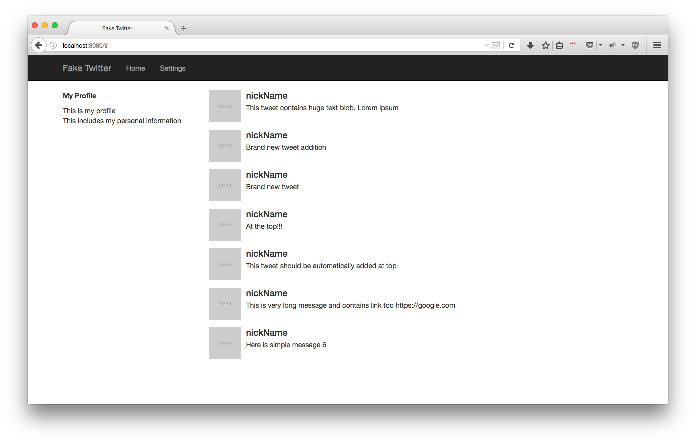
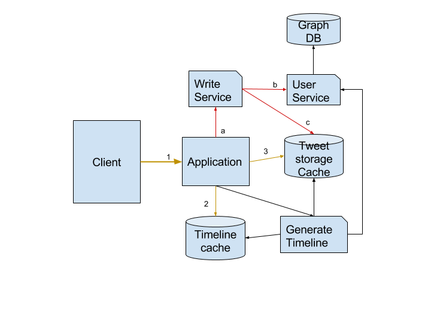

# Simple Twitter
This implements timeline feature of twitter. This is not complete application.

### Pre-requisite
Make sure you have installed mongodb (^2.6.7) and redis (^3.2.0) installed on your machine.

### Installation
`npm install`

### Runing locally
`npm run dev`

After that, you should be able to see something like this. You might not see any messages if you do not have any data.

### API
This implements three basic API. 

| API                                         | Description                                                               |
| ------------------------------------   | ----------------------------------------------------------------     |
| `GET /tweets`                      | This allows client to access current user's timeline. |
|`GET /tweets/:timestamp`  | Returns tweets after timestamp. This is useful once page is loaded and you want to auto refresh new tweets. |
|`POST /tweet`                      | This allows to post new tweets. |

Here is the architecture of current setup 

